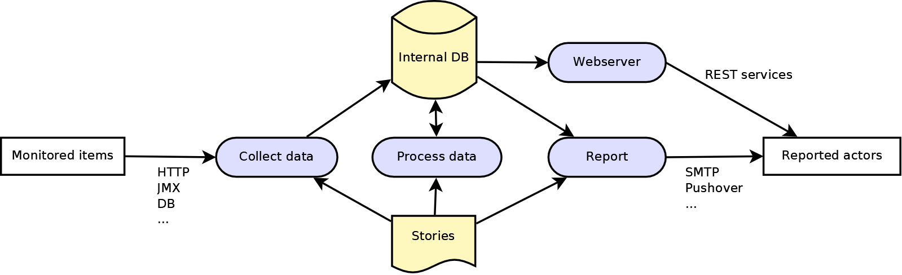

# Copper
Copper is a tool to **C**ollect **OP**erating data, **P**rocess and r**E**po**R**t them.
It's aim is to be a story-based monitoring and alerting tool.

[Copper 1.0](<https://github.com/dutoitc/copper/releases/tag/v1.0.0>) has been out in 2015 and stable since, with some improvments when needed.

Copper also provides an embedded WEB server to interact with stories, data or serve as monitoring UI server.


# Quick start
* (Use OpenJDK17 set as JAVA_HOME)
* mvn clean package
* cd sample
* ./sample.sh  or ./sample.bat
* Open browser on http://localhost:30400
* You see dashboard IHM, where you can create dashboards
* Open browser on http://localhost:30400/admin
* You see admin IHM

## Create WEB Story
* In "Stories", click "Create a story", then name it "CopperMonitoringWeb", put this story and save change:
```
RUN ON CRON */5 * * * *
GIVEN COLLECTOR WEB WITH url=http://localhost:30400
    KEEP responseCode AS COPPER_WEB_RETURN_CODE
THEN STORE VALUES
```
* Now you see the story in "stories". Run it.
* Open "Values" menu, there you see some collected values (or refresh after some time)


## Create JMX Story
* In "Stories", click "Create a story", then name it "MonitorSystem", put this story and save change:
```
RUN ON CRON * * * * *
GIVEN COLLECTOR JMX WITH url=service:jmx:rmi:///jndi/rmi://localhost:30409/server,user=null,password=null
    QUERY java.lang:type=OperatingSystem FOR SystemCpuLoad AS SYSTEM_CPU_LOAD
    QUERY java.lang:type=OperatingSystem FOR FreePhysicalMemorySize AS SYSTEM_FREE_MEMORY
THEN STORE VALUES

```
* Now you see the story in "stories". Run it.
* Open "Values" menu, there you see some collected values (or refresh after some time)
* Check SYSTEM_CPU_LOAD, then click on "Graph(small)", you can there see plotted values over time


# How does it work ?

The system is based on user stories, in nearly human language. Below are some examples.




1/Collect data
````
RUN ON CRON */5 7-18 * * 1-5
GIVEN COLLECTOR JMX WITH url=service:jmx:rmi://blah-blah,user=xxx,password=yyy
    QUERY objectName1 FOR att1    AS myVar1
    QUERY objectName2 FOR att2 AS myVar2
THEN STORE VALUES
````
(see [Collectors documentation](doc/collectors.md) for details)

2/Process data
(Example to be added)

3/Report
````
RUN ON CRON * * * * *
GIVEN STORED VALUES
WHEN myVar1>0.5
THEN REPORT BY MAIL to aUser@host.com,anotherUser@host.com
    WITH title="Purple alert!"
    WITH message="Holà capt'ain, the application tadah has a load of {{myVar1}} and a memory of {{myVar2}}"
````

Or a simple report
````
RUN ON CRON * * * * *
GIVEN COLLECTOR JDBC
    with url=jdbc://something
    with username=xxx
    with password=yyy
    EXECUTE SQL "select something from somewhere as myVar3"
WHEN CRON 0 6 * * 1-5
THEN REPORT BY MAIL to mycustomer@something.com
    WITH title="Daily reporting"
    WITH message="Dear customer, here is your income for your sells yesterday: {{myVar3}}"
````

(see [Reporters documentation](doc/reporters.md) for details)


4/ Webservices
Values can be accessed by web: <http://aHost:30400/copper/ws/value/XXX> with all values easily readable at <http://aHost:30400/copper>
(see [Web and Webservices documentation]doc/web.md) for details)


# Components
Here is a list of actual components:

## Collectors
* Web collector: get a web page, keep json first-level values
* Jmx collector: get values from JMX MBean server
* Jdbc collector: get values from Jdbc database
* Web collector: get values from a file on a server
* Socket collector: ping a socket
* Binary check collector: check if binary exists on disk

## Triggers
* When trigger: WHEN a>1, WHEN a<22, WHEN a=33, WHEN a>17.22, ... (float are equals if delta<1/25)

## Reporters
* Mail reporter: report values, messages by mail
* Slf4j reporter: report values in a log file
* Pushover reporter: report values on mobile phone via Pushover
* CSV reporter: report values as CSV

# WEB
Everything placed under a special folder 'externalweb' will be served as /web. This could be used to host a monitoring WEB application.
A special UI generator is available under /ui context.

# Future
Here is a little wishlist. Add yours (report to dutoitc@shimbawa.ch)
* Read values from property file (like username-passwords)
* service values security
* More collectors (logs)
* More reporters (Jabber, Mail)
* Improved triggering
* Rework story parsing with ebnf compiler ? parsing tree ?
* Generation of monitoring web applications
* Support processing by Groovy, plugins

# Customization
Some JVM arguments could be set:
* -Dcopper.properties=config/my.properties : use this properties file
* -Dcustom.properties=... : additional properties file
* -Dstories.folder=data/stories : use data/stories for stories folder (default: 'stories')
* -Dserver.port=12345 : listen on port 12345 (default: 8080)
* -Dserver.servlet.context-path=/mycontext/env-blah : use /mycontext/env-blah as WEB context (default: '/')

# Detailed documentation
* [Cookbook](doc/cookbook.md)
* [Collectors](doc/collectors.md)
* [Reporters](doc/reporters.md)
* [WEB Administration](doc/admin.md)
* [DEV](doc/dev.md)


# Troubleshooting
- Liquibase lock at startup (due to an startup failing)
  - create file clean.sql:
    `UPDATE DATABASECHANGELOGLOCK SET LOCKED=FALSE, LOCKGRANTED=null, LOCKEDBY=null where ID=1;`
  - execute sql: (adjust path)
    `java -classpath /tmp/h2-1.4.200.jar org.h2.tools.RunScript -url jdbc:h2:./data/copperdb -script clean.sql -user sa`
    
  
  [Travis-CI](https://travis-ci.com/github/dutoitc/copper)  
  
(update march 2020: travis-ci and sonarcloud configuration seems broken)  
